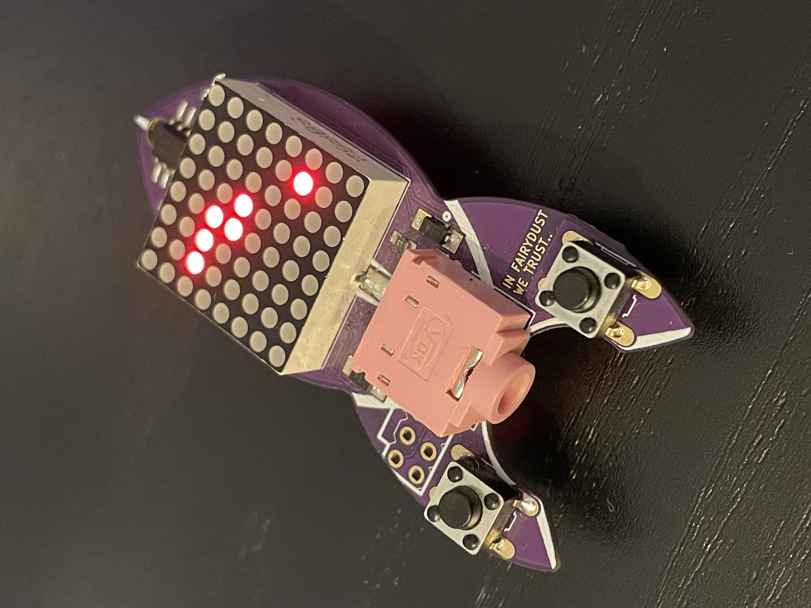

# Snake on blinkenrocket
This is a firmware for the [blinkenrocket](https://github.com/blinkenrocket) that allows you to play Snake on it. The blinkenrocket is a small soldering kit with an 8x8 dot matrix LED display and two buttons, controlled by an ATtiny88. 

## Installation
First get the binary from the [Releases](https://github.com/KubikDezimeter/blinkenrocket-snake/releases/latest) or build it from source.

Use [avrdude](https://github.com/avrdudes/avrdude) to flash it onto the blinkenrocket via the 6-pin ISP interface. I used a USBtiny programmer for this.

  
Alternatively, you can also build the firmware from source

  
  - Get the AVR toolchain (e.g. using the nix devshell from this repo).
  - Now just run `make` to build the firmware. You can find the resulting binary under `build/main.hex`. 
  - Run `make install` to flash the firmware to your blinkenrocket. You might have to use sudo if you haven't set up a udev rule to give your user access to the programmer.

## How to play
- Collect as many fruits as possible
- Watch out not to run into the walls or the snake's body
- Each fruit makes the snake a bit longer and increases its speed
- The two buttons are used to control the snake. Because there are only two buttons instead of four, they rotate the snake relative to its current direction
- To reset the game, press both buttons simultaneously
